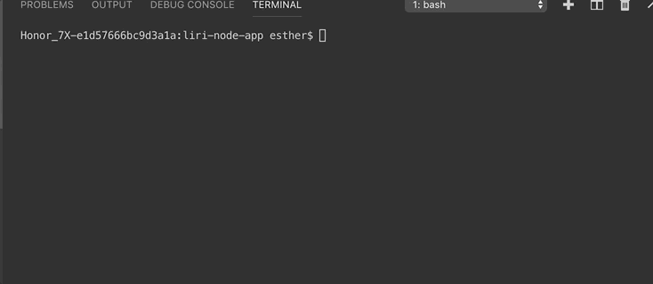
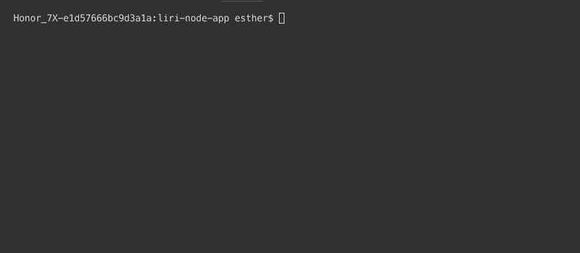
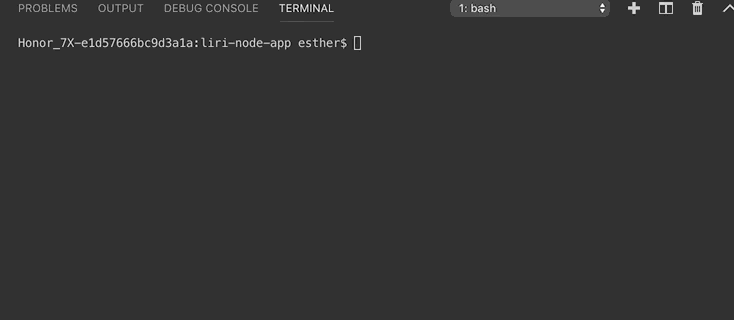

# liri-node-app
## Purpose:
This app is a Language Interpretation and Recognition Interface that gives the user information for concerts, songs, and movies.

## Instructions: 
User will have 4 prompt choices - "concert-this", "spotify-this-song", "movie-this", and "do-what-it-says." Then depending on the choice, user will type an artist/band name, song title, or movie title. Then the app will make its respective API calls to Bands in Town (for concert-this), Spotify (spotify-this-song), OMDB (movie-this) to retrieve more information on the concert/song/movie. If the "do-what-it-says" is selected, it will read whatever instruction is in random.txt file and run the app.

EX: spotify-this-song  

EX: movie-this  

EX: do-what-it-says  

### Link: 
https://esdalee.github.io/liri-node-app

### Technologies Used: 
Node (Axios, Spotify, Moment node packages), APIs (Bands in Town, Spotify, and OMDB) written with JS.

#### Developed by: Esther Lee
